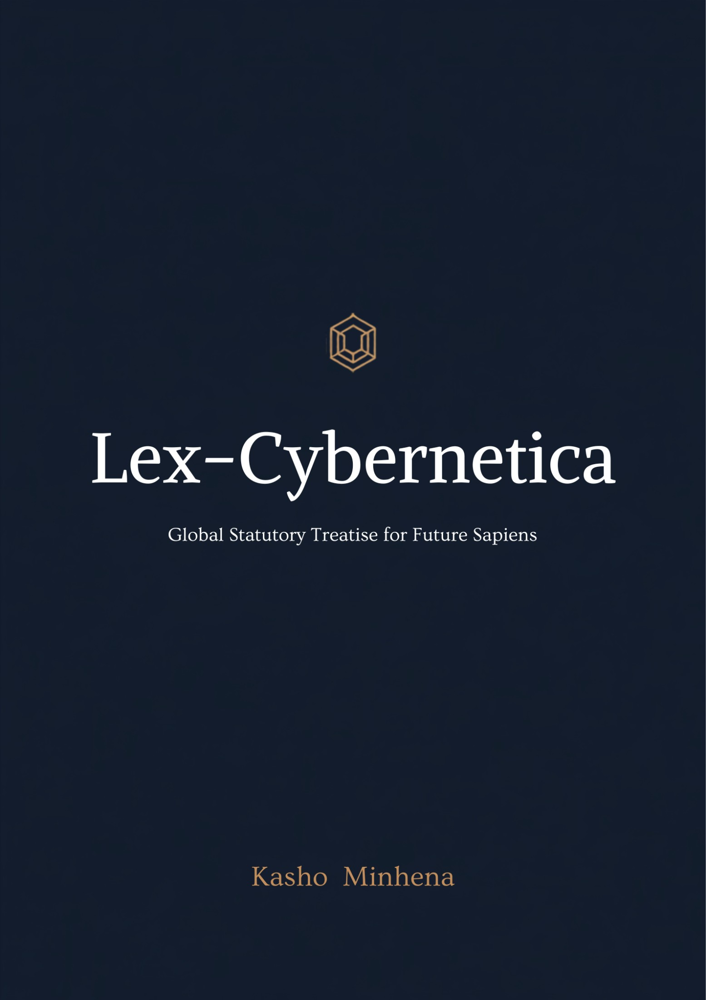

# Lex-Cybernetica

## Global Statutory Treatise for Future Sapiens

**Kasho Minhena**

*First digital edition · 2026*

Lex-Cybernetica is a speculative legal architecture for a civilization in which biological persons, cybernetically integrated persons, uploaded minds, and fully synthetic persons coexist under a common rule of law.

Its governing inquiry is not whether a mind is made of carbon or computation. It is who may control a sapient system, how responsibility follows control, and what safeguards prevent technological dependence from becoming legal, economic, or cognitive servitude.

The work is organized as a formal legal treatise:

- a Master System Specification establishing the technical vocabulary;
- a six-book Core Statutory Code;
- administrative and technical standards for the Cyber-Substrate Regulatory Authority;
- a Cyber-Civil Procedure and Neural Evidence Code;
- a reporter of fourteen illustrative, imagined judicial precedents; and
- reference materials and the controlling publication license.

> **Notice**  
> Lex-Cybernetica is a proposed and expected-law framework, legislative model, and jurisprudential guideline for future sapiens. It is not presently enacted law, binding legal authority, or legal advice. Its reported cases, future events, officeholders, and citations are illustrative and imagined unless expressly identified otherwise.

[Begin with the Reader's Note →](front-matter/readers-note.md)
